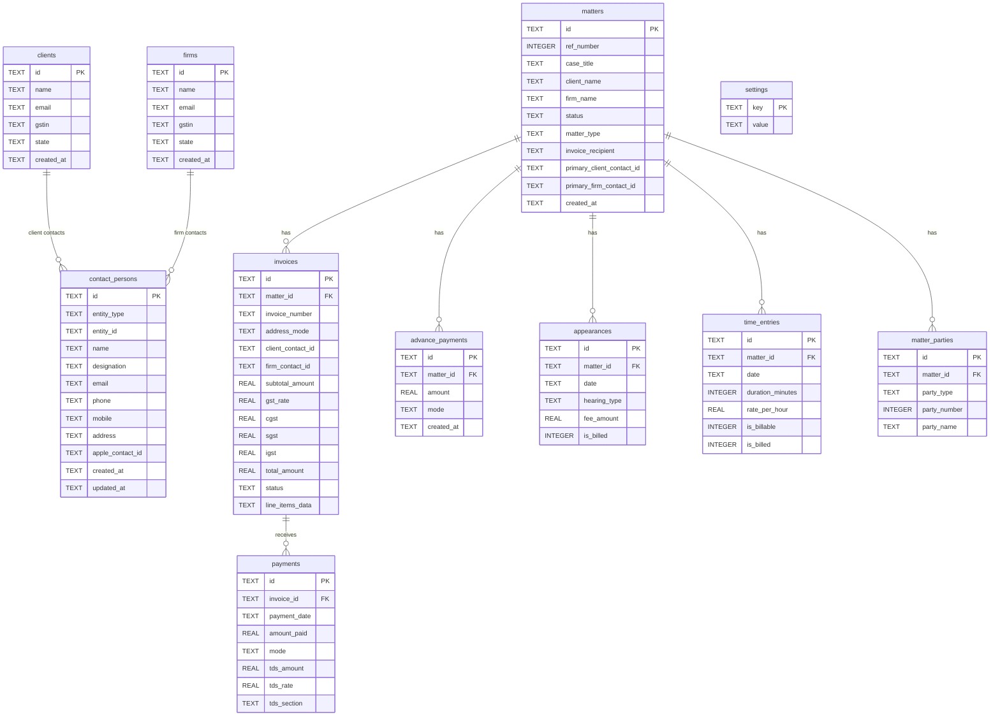

# Database Documentation — Memo v1.0.0

**Engine:** SQLite  
**File:** `~/Library/Application Support/com.memoapp.app/memoapp.db`  
**Schema source:** `src/db.ts → migrate()`  
**Last Updated:** 2026-06-02

---

## Overview

Memo uses a single SQLite database file. There is no ORM — all queries are raw SQL strings with parameterised placeholders (`?`). The schema is created and maintained entirely in `src/db.ts`.

### Key Design Decisions

1. **Denormalised matter data** — `matters.client_name` and `matters.firm_name` store the names as free text strings. There is no hard foreign key to `clients` or `firms`. This allows matters to exist without a saved client/firm record and simplifies the data entry flow.

2. **Soft references** — `matters.primary_client_contact_id` and `matters.primary_firm_contact_id` reference `contact_persons.id` but without a FK constraint. If a contact person is deleted, the matter retains a stale ID (application handles this gracefully by checking for null).

3. **All dates as TEXT** — Dates are stored as ISO 8601 strings (`YYYY-MM-DD` for dates, full ISO 8601 for timestamps). SQLite has no native date type.

4. **Booleans as INTEGER** — `is_billed`, `is_billable` stored as `0` or `1`.

5. **line_items_data as JSON** — Invoice line items stored as a JSON string in a single TEXT column rather than a separate table. This simplifies the invoice creation and avoids a join.

---

## Migration Strategy

### `addIfMissing` Pattern

Every schema change uses a safe `ALTER TABLE ADD COLUMN` wrapped in try/catch:

```typescript
const addIfMissing = async (table: string, column: string, type: string) => {
  try {
    await db.execute(`ALTER TABLE ${table} ADD COLUMN ${column} ${type}`);
  } catch {
    // Column already exists — ignore
  }
};
```

This is called on every app startup in `migrate()`. The `CREATE TABLE IF NOT EXISTS` statements ensure tables exist; `addIfMissing` ensures new columns are added to existing databases.

### Migration History

| Column | Table | Version Added |
|---|---|---|
| `handler_name` | matters | Early |
| `handler_designation` | matters | Early |
| `handler_email` | matters | Early |
| `handler_phone` | matters | Early |
| `invoice_recipient` | matters | Early |
| `tds_amount` | payments | TDS feature |
| `tds_rate` | payments | TDS feature |
| `tds_section` | payments | TDS feature |
| `ref_number` | matters | Reference number feature |
| `primary_client_contact_id` | matters | Contact persons feature |
| `primary_firm_contact_id` | matters | Contact persons feature |
| `address_mode` | invoices | 6-option addressing feature |
| `client_contact_id` | invoices | 6-option addressing feature |
| `firm_contact_id` | invoices | 6-option addressing feature |

### Backfill Logic

On the migration run that added `ref_number`, the following backfill runs:

```sql
-- Find matters without ref_number
SELECT id FROM matters WHERE ref_number IS NULL ORDER BY created_at ASC

-- Get current max
SELECT COALESCE(MAX(ref_number), 0) AS max FROM matters WHERE ref_number IS NOT NULL

-- Assign sequential numbers
UPDATE matters SET ref_number = ? WHERE id = ?
```

---

## Tables

---

### `matters`

The central table. Every legal matter is one row. All related records cascade-delete when a matter is deleted.

```sql
CREATE TABLE IF NOT EXISTS matters (
  id                        TEXT PRIMARY KEY,
  case_title                TEXT NOT NULL,
  client_name               TEXT NOT NULL,
  client_email              TEXT,
  client_gstin              TEXT,
  client_state              TEXT,
  court                     TEXT,
  matter_number             TEXT,
  matter_type               TEXT NOT NULL DEFAULT 'litigation',
  status                    TEXT NOT NULL DEFAULT 'active',
  firm_name                 TEXT,
  firm_email                TEXT,
  firm_gstin                TEXT,
  firm_state                TEXT,
  handler_name              TEXT,
  handler_designation       TEXT,
  handler_email             TEXT,
  handler_phone             TEXT,
  notes                     TEXT,
  created_at                TEXT NOT NULL
  -- Added via addIfMissing:
  -- invoice_recipient       TEXT
  -- ref_number              INTEGER
  -- primary_client_contact_id TEXT
  -- primary_firm_contact_id   TEXT
);
```

**Full Column Reference:**

| Column | Type | Required | Description |
|---|---|---|---|
| `id` | TEXT | PK | UUID v4 |
| `ref_number` | INTEGER | nullable | App-assigned sequential number. Backfilled. |
| `case_title` | TEXT | NOT NULL | Primary display name |
| `client_name` | TEXT | NOT NULL | Denormalised; not FK |
| `client_email` | TEXT | | |
| `client_gstin` | TEXT | | 15-char GST number |
| `client_state` | TEXT | | Indian state name |
| `court` | TEXT | | Court / forum name |
| `matter_number` | TEXT | | Court-assigned case number |
| `matter_type` | TEXT | NOT NULL, DEFAULT 'litigation' | litigation\|advisory\|drafting\|corporate\|other |
| `status` | TEXT | NOT NULL, DEFAULT 'active' | active\|closed\|on-hold |
| `firm_name` | TEXT | | AOR/Firm name |
| `firm_email` | TEXT | | |
| `firm_gstin` | TEXT | | |
| `firm_state` | TEXT | | |
| `handler_name` | TEXT | | Advocate handling matter |
| `handler_designation` | TEXT | | e.g. "Partner" |
| `handler_email` | TEXT | | |
| `handler_phone` | TEXT | | |
| `notes` | TEXT | | |
| `invoice_recipient` | TEXT | | firm\|client\|both |
| `primary_client_contact_id` | TEXT | | Soft ref → contact_persons.id |
| `primary_firm_contact_id` | TEXT | | Soft ref → contact_persons.id |
| `created_at` | TEXT | NOT NULL | ISO 8601 timestamp |

**Indexes:** PK only  
**Triggers:** None  
**Constraints:** `id` PRIMARY KEY, `case_title` NOT NULL, `client_name` NOT NULL

---

### `clients`

Reusable client directory.

```sql
CREATE TABLE IF NOT EXISTS clients (
  id         TEXT PRIMARY KEY,
  name       TEXT NOT NULL,
  email      TEXT,
  phone      TEXT,
  gstin      TEXT,
  state      TEXT,
  address    TEXT,
  notes      TEXT,
  created_at TEXT NOT NULL
);
```

| Column | Type | Required | Description |
|---|---|---|---|
| `id` | TEXT | PK | UUID v4 |
| `name` | TEXT | NOT NULL | Display name |
| `email` | TEXT | | |
| `phone` | TEXT | | |
| `gstin` | TEXT | | |
| `state` | TEXT | | Indian state |
| `address` | TEXT | | Free-text address |
| `notes` | TEXT | | |
| `created_at` | TEXT | NOT NULL | |

---

### `firms`

Reusable AOR / engaging firm directory. Identical structure to `clients`.

```sql
CREATE TABLE IF NOT EXISTS firms (
  id TEXT PRIMARY KEY, name TEXT NOT NULL, email TEXT, phone TEXT,
  gstin TEXT, state TEXT, address TEXT, notes TEXT, created_at TEXT NOT NULL
);
```

---

### `contact_persons`

Named individuals within a client or firm who can be addressed on invoices.

```sql
CREATE TABLE IF NOT EXISTS contact_persons (
  id                TEXT PRIMARY KEY,
  entity_type       TEXT NOT NULL,
  entity_id         TEXT NOT NULL,
  name              TEXT NOT NULL,
  designation       TEXT,
  company           TEXT,
  email             TEXT,
  phone             TEXT,
  mobile            TEXT,
  address           TEXT,
  notes             TEXT,
  apple_contact_id  TEXT,
  created_at        TEXT NOT NULL,
  updated_at        TEXT NOT NULL
);
```

| Column | Type | Required | Description |
|---|---|---|---|
| `id` | TEXT | PK | UUID v4 |
| `entity_type` | TEXT | NOT NULL | `client` or `firm` |
| `entity_id` | TEXT | NOT NULL | ID of parent client or firm |
| `name` | TEXT | NOT NULL | Full name |
| `designation` | TEXT | | e.g. "Partner", "GM Legal" |
| `company` | TEXT | | May differ from parent entity name |
| `email` | TEXT | | |
| `phone` | TEXT | | Office |
| `mobile` | TEXT | | Mobile |
| `address` | TEXT | | Postal address (used in invoice header) |
| `notes` | TEXT | | |
| `apple_contact_id` | TEXT | | Reserved for future Contacts sync |
| `created_at` | TEXT | NOT NULL | |
| `updated_at` | TEXT | NOT NULL | Updated on every edit |

**Note:** `entity_id` + `entity_type` form a logical composite FK to either `clients.id` or `firms.id`. No hard constraint (SQLite). Application enforces this.

---

### `invoices`

Invoice records with full GST breakdown and addressing configuration.

```sql
CREATE TABLE IF NOT EXISTS invoices (
  id              TEXT PRIMARY KEY,
  matter_id       TEXT NOT NULL REFERENCES matters(id) ON DELETE CASCADE,
  invoice_number  TEXT NOT NULL,
  invoice_date    TEXT NOT NULL,
  due_date        TEXT NOT NULL,
  recipient_type  TEXT NOT NULL DEFAULT 'client',
  subtotal_amount REAL NOT NULL DEFAULT 0,
  gst_rate        REAL NOT NULL DEFAULT 18,
  cgst            REAL NOT NULL DEFAULT 0,
  sgst            REAL NOT NULL DEFAULT 0,
  igst            REAL NOT NULL DEFAULT 0,
  total_amount    REAL NOT NULL DEFAULT 0,
  status          TEXT NOT NULL DEFAULT 'draft',
  notes           TEXT,
  pdf_path        TEXT,
  line_items_data TEXT
  -- Added via addIfMissing:
  -- address_mode       TEXT
  -- client_contact_id  TEXT
  -- firm_contact_id    TEXT
);
```

| Column | Type | Required | Description |
|---|---|---|---|
| `id` | TEXT | PK | UUID v4 |
| `matter_id` | TEXT | NOT NULL, FK | References matters(id) CASCADE DELETE |
| `invoice_number` | TEXT | NOT NULL | e.g. "INV-202605-001" |
| `invoice_date` | TEXT | NOT NULL | YYYY-MM-DD |
| `due_date` | TEXT | NOT NULL | YYYY-MM-DD |
| `recipient_type` | TEXT | NOT NULL | `firm\|client\|both` (legacy; use `address_mode`) |
| `address_mode` | TEXT | | `org_firm\|org_client\|org_both\|contact_firm\|contact_client\|contact_both` |
| `client_contact_id` | TEXT | | FK → contact_persons.id |
| `firm_contact_id` | TEXT | | FK → contact_persons.id |
| `subtotal_amount` | REAL | NOT NULL | Before GST |
| `gst_rate` | REAL | NOT NULL | 0/5/12/18 |
| `cgst` | REAL | NOT NULL | Central GST |
| `sgst` | REAL | NOT NULL | State GST |
| `igst` | REAL | NOT NULL | Integrated GST |
| `total_amount` | REAL | NOT NULL | subtotal + all GST |
| `status` | TEXT | NOT NULL | draft\|sent\|paid\|partially_paid\|overdue\|cancelled |
| `notes` | TEXT | | |
| `pdf_path` | TEXT | | Reserved; unused |
| `line_items_data` | TEXT | | JSON array of LineItem |

**`line_items_data` JSON Schema:**
```typescript
interface LineItem {
  description: string;    // "15 Apr 26 — Hearing — Bombay High Court"
  amount: number;         // 20000
  type: "appearance" | "time" | "expense" | "other";
  sourceId?: string;      // UUID of source appearance or time_entry
}
```

---

### `payments`

Payment receipts against invoices, including TDS.

```sql
CREATE TABLE IF NOT EXISTS payments (
  id            TEXT PRIMARY KEY,
  invoice_id    TEXT NOT NULL REFERENCES invoices(id) ON DELETE CASCADE,
  payment_date  TEXT NOT NULL,
  amount_paid   REAL NOT NULL DEFAULT 0,
  mode          TEXT NOT NULL DEFAULT 'NEFT',
  notes         TEXT
  -- Added via addIfMissing:
  -- tds_amount  REAL DEFAULT 0
  -- tds_rate    REAL DEFAULT 0
  -- tds_section TEXT
);
```

| Column | Type | Required | Description |
|---|---|---|---|
| `id` | TEXT | PK | UUID v4 |
| `invoice_id` | TEXT | NOT NULL, FK | References invoices(id) CASCADE DELETE |
| `payment_date` | TEXT | NOT NULL | YYYY-MM-DD |
| `amount_paid` | REAL | NOT NULL | Cash/bank amount received |
| `mode` | TEXT | NOT NULL | NEFT\|RTGS\|IMPS\|UPI\|cheque\|cash\|other |
| `notes` | TEXT | | |
| `tds_amount` | REAL | DEFAULT 0 | Tax deducted at source |
| `tds_rate` | REAL | DEFAULT 0 | TDS rate % |
| `tds_section` | TEXT | | 194J(b)\|194J(a)\|194C(1)\|194C(2)\|custom |

**Settlement formula:**
```
total_settled = SUM(amount_paid) + SUM(tds_amount)
invoice is PAID when total_settled >= invoice.total_amount
```

---

### `advance_payments`

Advance / retainer payments per matter, not tied to a specific invoice.

```sql
CREATE TABLE IF NOT EXISTS advance_payments (
  id           TEXT PRIMARY KEY,
  matter_id    TEXT NOT NULL REFERENCES matters(id) ON DELETE CASCADE,
  payment_date TEXT NOT NULL,
  amount       REAL NOT NULL DEFAULT 0,
  mode         TEXT NOT NULL DEFAULT 'NEFT',
  notes        TEXT,
  created_at   TEXT NOT NULL
);
```

---

### `appearances`

Court appearances logged per matter.

```sql
CREATE TABLE IF NOT EXISTS appearances (
  id           TEXT PRIMARY KEY,
  matter_id    TEXT NOT NULL REFERENCES matters(id) ON DELETE CASCADE,
  date         TEXT NOT NULL,
  court        TEXT,
  hearing_type TEXT NOT NULL DEFAULT 'mention',
  fee_amount   REAL NOT NULL DEFAULT 0,
  is_billed    INTEGER NOT NULL DEFAULT 0,
  notes        TEXT
);
```

| Column | Type | Required | Description |
|---|---|---|---|
| `id` | TEXT | PK | UUID v4 |
| `matter_id` | TEXT | NOT NULL, FK | |
| `date` | TEXT | NOT NULL | YYYY-MM-DD |
| `court` | TEXT | | |
| `hearing_type` | TEXT | NOT NULL | See full list in FEATURE_CATALOG |
| `fee_amount` | REAL | NOT NULL | Appearance fee in INR |
| `is_billed` | INTEGER | NOT NULL | 0=unbilled, 1=included in sent invoice |
| `notes` | TEXT | | |

---

### `time_entries`

Billable and non-billable time per matter.

```sql
CREATE TABLE IF NOT EXISTS time_entries (
  id               TEXT PRIMARY KEY,
  matter_id        TEXT NOT NULL REFERENCES matters(id) ON DELETE CASCADE,
  date             TEXT NOT NULL,
  description      TEXT,
  duration_minutes INTEGER NOT NULL DEFAULT 0,
  rate_per_hour    REAL NOT NULL DEFAULT 0,
  is_billable      INTEGER NOT NULL DEFAULT 1,
  is_billed        INTEGER NOT NULL DEFAULT 0
);
```

**Computed billing amount:** `(duration_minutes / 60.0) × rate_per_hour`

---

### `matter_parties`

Parties represented in a matter (used on invoice PDFs).

```sql
CREATE TABLE IF NOT EXISTS matter_parties (
  id           TEXT PRIMARY KEY,
  matter_id    TEXT NOT NULL REFERENCES matters(id) ON DELETE CASCADE,
  party_type   TEXT NOT NULL,
  party_number INTEGER,
  party_name   TEXT,
  notes        TEXT
);
```

| Column | Type | Description |
|---|---|---|
| `party_type` | TEXT | e.g. "Petitioner", "Respondent", "Appellant" |
| `party_number` | INTEGER | e.g. 2 for "Respondent No. 2" |
| `party_name` | TEXT | Full name of the party |

**Display format:** `formatParty(p)` → `"Respondent No. 2 — ABC Corp"`

---

### `settings`

Key-value store for application configuration and profile.

```sql
CREATE TABLE IF NOT EXISTS settings (
  key   TEXT PRIMARY KEY,
  value TEXT NOT NULL
);
```

**Known Keys:**

| Key | Value Type | Description |
|---|---|---|
| `profile` | JSON: `Profile` object | Advocate/firm identity, bank details, invoice preferences |
| `lock` | JSON: `{ hash: string }` | SHA-256 hex of PIN |

**Profile JSON structure (abbreviated):**
```typescript
{
  advocateName: string;      firmName: string;
  designation: string;       barCouncilNumber: string;
  addressLine1: string;      addressLine2: string;
  city: string;              state: string;
  pincode: string;           phone: string;
  email: string;             website: string;
  gstin: string;             pan: string;
  bankName: string;          bankBranch: string;
  accountNumber: string;     ifscCode: string;
  accountHolder: string;     upiId: string;
  invoicePrefix: string;     invoiceTemplate: "modern"|"classic"|"minimal";
  signatureText: string;     defaultGstRate: number;
  invoiceCustomization: InvoiceCustomization;
}
```

---

## Entity Relationship Diagram



---

## Backup Schema

The 11 tables are backed up in this order:

```
settings → clients → firms → matters → matter_parties →
contact_persons → appearances → time_entries →
invoices → payments → advance_payments
```

Restore (deletion) runs in reverse-dependency order:

```
advance_payments → payments → invoices →
time_entries → appearances → matter_parties →
matters → firms → clients → settings
```
