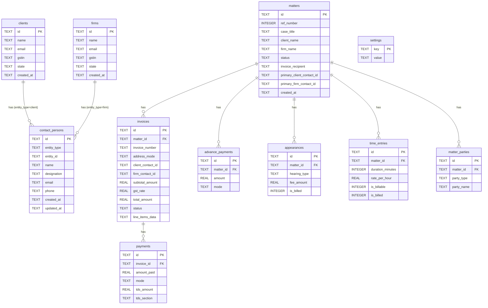

# Memo — Master Project Documentation

**Version:** 1.0.0 | **Platform:** macOS | **Last Updated:** 2026-06-02  
**Bundle ID:** `com.memoapp.app` | **Repository:** MemoAppTauri

---

## Table of Contents

1. [Executive Summary](#1-executive-summary)
2. [Product Overview](#2-product-overview)
3. [Feature Inventory](#3-feature-inventory)
4. [Functional Requirements](#4-functional-requirements)
5. [User Roles & Permissions](#5-user-roles--permissions)
6. [Application Architecture](#6-application-architecture)
7. [Technology Stack](#7-technology-stack)
8. [Database Documentation](#8-database-documentation)
9. [API Documentation](#9-api-documentation)
10. [Screen Documentation](#10-screen-documentation)
11. [Business Logic Documentation](#11-business-logic-documentation)
12. [Security Documentation](#12-security-documentation)
13. [Deployment Documentation](#13-deployment-documentation)
14. [Testing Documentation](#14-testing-documentation)
15. [Known Limitations](#15-known-limitations)
16. [Future Roadmap](#16-future-roadmap)
17. [AI Developer Handoff](#17-ai-developer-handoff)

---

## 1. Executive Summary

### What the Application Does

Memo is a **native macOS desktop application** for legal billing and matter management, purpose-built for Indian advocates and law firms. It replaces manual billing workflows — spreadsheets, Word documents, WhatsApp notes — with a structured, GST-compliant system that runs entirely on the practitioner's Mac without any cloud dependency.

### Who It Is For

- **Solo advocates** who handle their own billing
- **Small to mid-size law firms** (2–30 advocates) with a practice manager or billing administrator
- **AOR (Advocates on Record)** who receive briefs from outstation firms and need to manage multiple matters and invoicing relationships simultaneously

### Primary Use Cases

1. Create and track legal matters from instruction to closure
2. Log court appearances and billable time against matters
3. Generate GST-compliant PDF invoices with professional templates
4. Record and reconcile payments including TDS deductions
5. Manage a directory of clients, AOR firms, and named contact persons
6. Export data backups and restore from them

### Key Benefits

| Benefit | Description |
|---|---|
| **100% offline** | No internet required; no data sent to any server |
| **GST-compliant** | Auto-calculates CGST/SGST (same state) or IGST (inter-state) |
| **TDS-aware** | Distinguishes legitimate TDS deductions from genuine shortfalls |
| **Free forever** | No subscription, no per-invoice fee |
| **macOS-native** | Uses native Contacts integration, file dialogs, UPI deep-links |
| **Audit trail** | Every matter has a sequential reference number; payments are immutable records |

---

## 2. Product Overview

### Business Purpose

Indian advocates bill clients in a legally specific way: fees are subject to 18% GST (with CGST+SGST for intra-state or IGST for inter-state transactions), and corporate clients typically deduct TDS at 10% under section 194J(b). Managing this manually across dozens of active matters creates errors, unpaid invoices, and compliance risk. Memo solves this by providing a structured, pre-configured workflow.

### User Personas

**Persona 1 — The Solo Advocate**
- Handles 15–40 active matters
- Does their own billing at month-end
- Pain point: tracking which appearances are billed, calculating GST correctly

**Persona 2 — The Practice Manager**
- Works in a firm with 5–15 advocates
- Manages billing across multiple handlers
- Pain point: knowing outstanding dues at a glance, generating invoices quickly

**Persona 3 — The AOR**
- Receives briefs from multiple outstation firms
- Invoices both the instructing firm and the end client
- Pain point: keeping track of which firm instructed which matter, addressing invoices correctly

### Core Workflows

```
Matter Creation → Work Logging → Invoice Generation → Payment Recording → Reconciliation
```

1. **Matter Setup**: Create a matter, link it to a client and/or AOR firm, set the default billing recipient
2. **Work Logging**: Log appearances (with hearing type and fee) and time entries (with duration and hourly rate) as work happens
3. **Invoice Generation**: Select unbilled work items, choose invoice addressing (6 options), generate GST-compliant PDF
4. **Payment Recording**: Record cash received with payment mode; log TDS deductions with the applicable section
5. **Reconciliation**: App distinguishes "fully settled", "TDS mismatch", and "genuine shortfall" automatically

### Functional Scope

| In Scope | Out of Scope |
|---|---|
| Matter & client management | Online payment collection |
| GST invoice generation & PDF export | Court date calendaring / reminders |
| Payment & TDS reconciliation | Multi-user / team access |
| macOS Contacts integration | Mobile app (iOS/Android) |
| Backup & restore (JSON) | Cloud sync |
| App lock (PIN) | Document management / drafting |
| Invoice template customisation | Email sending |
| Outstanding dues dashboard | Accounting / tally integration |

### Out-of-Scope Items

- **No cloud sync**: Data never leaves the device during normal operation
- **No email delivery**: PDFs must be downloaded and sent manually
- **No multi-device**: Database is a single local file; no sync between Macs
- **No accounting integration**: No export to Tally, QuickBooks, or Zoho Books
- **No e-invoicing (IRN)**: GST e-invoicing portal integration not implemented

---

## 3. Feature Inventory

### Feature 1 — Matter Management

| Attribute | Detail |
|---|---|
| **Purpose** | Central record for each legal case or engagement |
| **User workflow** | Click + → fill case title, client, AOR/firm, type, status → Save |
| **Key screens** | MatterList, MatterForm, MatterDetail |
| **DB tables** | `matters`, `matter_parties` |
| **APIs** | `insertMatter`, `updateMatter`, `fetchMatters`, `deleteMatter` |
| **Permissions** | None (no auth required beyond app lock) |
| **Dependencies** | Clients and Firms directories (soft reference by name) |

**Notable behaviours:**
- Auto-assigns sequential `ref_number` (#001, #002…) on insert
- `client_name` and `firm_name` are stored as free text (denormalised) — no hard FK to `clients`/`firms` tables, allowing matters to exist without a saved client record
- MatterForm has an inline entity picker that searches saved clients/firms and offers to save new ones to the directory without leaving the form

---

### Feature 2 — Client Directory

| Attribute | Detail |
|---|---|
| **Purpose** | Reusable client records for faster matter creation |
| **User workflow** | Clients → + → fill details (or import from Contacts) → Save |
| **Key screens** | ContactList (type="client"), ContactDetail, ContactForm |
| **DB tables** | `clients`, `contact_persons` |
| **APIs** | `fetchClients`, `insertClient`, `updateClient`, `deleteClient` |
| **Permissions** | None |
| **Dependencies** | macOS Contacts (optional import) |

---

### Feature 3 — AOR / Firm Directory

| Attribute | Detail |
|---|---|
| **Purpose** | Reusable records for Advocates on Record and engaging law firms |
| **User workflow** | AOR/Firms → + → fill details (or import from Contacts) → Save |
| **Key screens** | ContactList (type="firm"), ContactDetail, ContactForm |
| **DB tables** | `firms`, `contact_persons` |
| **APIs** | `fetchFirms`, `insertFirm`, `updateFirm`, `deleteFirm` |
| **Permissions** | None |
| **Dependencies** | macOS Contacts (optional import) |

---

### Feature 4 — Contact Persons

| Attribute | Detail |
|---|---|
| **Purpose** | Named individuals within a client or firm who can be addressed on invoices |
| **User workflow** | Open client/firm record → Contact Persons → Add → fill or import from Contacts |
| **Key screens** | ContactPersonsPanel (embedded in ContactDetail) |
| **DB tables** | `contact_persons` |
| **APIs** | `fetchContactPersons`, `insertContactPerson`, `updateContactPerson`, `deleteContactPerson` |
| **Permissions** | macOS Contacts (for import) |
| **Dependencies** | Must belong to a `clients` or `firms` record |

---

### Feature 5 — macOS Contacts Import

| Attribute | Detail |
|---|---|
| **Purpose** | Import contact details from macOS Contacts app to avoid manual entry |
| **User workflow** | Click "From Contacts" button → search by name → click result → fields auto-fill |
| **Key screens** | ContactPickerModal (in ContactList.tsx and ContactPersonsPanel.tsx) |
| **DB tables** | None (data flows into form fields only) |
| **APIs** | Tauri IPC: `search_contacts` (Rust command) |
| **Permissions** | macOS TCC: Contacts |
| **Dependencies** | macOS, osascript, JXA |

---

### Feature 6 — Appearances Tracking

| Attribute | Detail |
|---|---|
| **Purpose** | Log court appearances with hearing type and fee |
| **User workflow** | Open matter → Appearances tab → + Add → fill date, court, hearing type, fee → Save |
| **Key screens** | Appearances.tsx |
| **DB tables** | `appearances` |
| **APIs** | `fetchAppearances`, `insertAppearance`, `updateAppearance`, `deleteAppearance`, `markAppearancesBilled` |
| **Permissions** | None |
| **Dependencies** | Requires a matter |

**Hearing types:** mention, urgent\_mention, hearing, adjournment, circulation, arguments, evidence, judgement, admission, caveat, board, conference, drafting, research, advice, retainer, filing, other

---

### Feature 7 — Time Entry Tracking

| Attribute | Detail |
|---|---|
| **Purpose** | Log billable and non-billable time with hourly rate |
| **User workflow** | Open matter → Time tab → + Add → fill date, description, duration, rate, billable flag → Save |
| **Key screens** | TimeEntries.tsx |
| **DB tables** | `time_entries` |
| **APIs** | `fetchTimeEntries`, `insertTimeEntry`, `updateTimeEntry`, `deleteTimeEntry`, `markTimeEntriesBilled` |
| **Permissions** | None |
| **Dependencies** | Requires a matter |

---

### Feature 8 — Invoice Generation

| Attribute | Detail |
|---|---|
| **Purpose** | Generate GST-compliant invoices from logged work |
| **User workflow** | Open matter → Invoices → New Invoice → select items → choose addressing → Save → Download PDF |
| **Key screens** | Invoices.tsx (InvoiceForm, InvoiceRow), InvoicePDF.tsx |
| **DB tables** | `invoices`, `appearances` (is\_billed update), `time_entries` (is\_billed update) |
| **APIs** | `insertInvoice`, `fetchInvoices`, `fetchAllBillableAppearances`, `fetchAllBillableTimeEntries`, `markAppearancesBilled`, `markTimeEntriesBilled` |
| **Permissions** | `fs:allow-write-file` (PDF save), `dialog:allow-save` |
| **Dependencies** | @react-pdf/renderer, tauri-plugin-fs, tauri-plugin-dialog |

---

### Feature 9 — Invoice Addressing (6 Options)

| Option | Code | Description |
|---|---|---|
| A | `org_firm` | AOR/Firm organisation name, GSTIN, state |
| B | `org_client` | Client organisation name, GSTIN, state |
| C | `org_both` | Both organisations |
| D | `contact_firm` | Named contact person at AOR/Firm |
| E | `contact_client` | Named contact person at Client |
| F | `contact_both` | Named contact persons at both |

---

### Feature 10 — Invoice Templates

| Template | Style |
|---|---|
| **Modern** | Coloured header band, accent colour customisable, clean sans-serif |
| **Classic** | Times-Roman letterhead style, traditional legal document look |
| **Minimal** | Clean two-column layout, minimal borders |

All three templates support: GST breakdown toggle, bank details toggle, signature toggle, matter info toggle, header note, footer note, custom fields, accent colour.

---

### Feature 11 — Payment Recording & TDS Reconciliation

| Attribute | Detail |
|---|---|
| **Purpose** | Record payments against invoices; distinguish TDS from shortfall |
| **User workflow** | Expand invoice → Record Payment → enter amount, mode, TDS details → Save |
| **Key screens** | RecordPayment.tsx (two-column), Invoices.tsx (PaymentForm), OutstandingDues.tsx |
| **DB tables** | `payments` |
| **APIs** | `insertPayment`, `fetchPayments`, `fetchInvoiceSettlement`, `deletePayment` |
| **Permissions** | None |
| **Dependencies** | Requires an invoice |

**TDS sections supported:** 194J(b) 10%, 194J(a) 2%, 194C(1) 1%, 194C(2) 2%, custom rate

---

### Feature 12 — Advance Payments

| Attribute | Detail |
|---|---|
| **Purpose** | Record retainer / advance fees not tied to a specific invoice |
| **Key screens** | RecordPayment.tsx |
| **DB tables** | `advance_payments` |
| **APIs** | `insertAdvancePayment`, `fetchAdvancePayments`, `deleteAdvancePayment` |

---

### Feature 13 — Outstanding Dues Dashboard

| Attribute | Detail |
|---|---|
| **Purpose** | Cross-matter view of all unpaid invoices |
| **Key screens** | OutstandingDues.tsx |
| **DB tables** | `invoices`, `payments`, `matters` |
| **APIs** | `fetchAllUnpaidInvoices`, `insertPayment` |

---

### Feature 14 — Invoice Designer

| Attribute | Detail |
|---|---|
| **Purpose** | Live-preview customisation of invoice templates |
| **Key screens** | InvoiceDesigner.tsx (embedded in Settings) |
| **DB tables** | `settings` (profile.invoiceCustomization) |
| **APIs** | `saveProfile` |

---

### Feature 15 — Backup & Restore

| Attribute | Detail |
|---|---|
| **Purpose** | Export and import full database as JSON |
| **Key screens** | SettingsPage.tsx (Backup & Restore section) |
| **DB tables** | All 11 tables |
| **APIs** | `exportAllData`, `importAllData`, `dialogSave`, `dialogOpen`, `writeTextFile`, `readTextFile` |
| **Permissions** | `dialog:allow-save`, `dialog:allow-open`, `fs:allow-write-text-file`, `fs:allow-read-text-file` |

---

### Feature 16 — App Lock

| Attribute | Detail |
|---|---|
| **Purpose** | PIN lock to protect sensitive client data |
| **Key screens** | LockScreen.tsx, LockSettings.tsx |
| **DB tables** | `settings` (key: `lock`) |
| **APIs** | `getLock`, `setLock`, `verifyLock`, `removeLock` |

---

### Feature 17 — Matter Parties

| Attribute | Detail |
|---|---|
| **Purpose** | Track parties represented (petitioner, respondent, etc.) |
| **Key screens** | MatterParties.tsx |
| **DB tables** | `matter_parties` |
| **APIs** | `fetchMatterParties`, `insertMatterParty`, `updateMatterParty`, `deleteMatterParty` |

---

### Feature 18 — Developer Tip (Inactive)

| Attribute | Detail |
|---|---|
| **Purpose** | One-time optional tip to the developer |
| **Key screens** | SupportModal.tsx (hidden behind `{false && ...}`) |
| **Mechanism** | UPI deep-link `upi://pay?pa=ssmendon@icici&am=…` opened via `openUrl` |
| **Status** | **Inactive** — UI hidden; code complete |

---

## 4. Functional Requirements

### FR-01: Matter Management
- FR-01.1: System shall allow creation of a matter with case title (required), client name (required), matter type, status, court, court case number, AOR/firm details, and handler details
- FR-01.2: System shall auto-assign a sequential reference number to each new matter
- FR-01.3: System shall support matter statuses: active, closed, on-hold
- FR-01.4: System shall allow filtering matters by client or firm in the list view
- FR-01.5: System shall allow full-text search across matter title, client name, and firm name
- FR-01.6: System shall cascade-delete all related records when a matter is deleted

### FR-02: Client & Firm Directory
- FR-02.1: System shall maintain a reusable directory of clients and firms separate from matters
- FR-02.2: System shall allow linking a saved client/firm to a matter with auto-fill of fields
- FR-02.3: System shall display all linked matters on each client/firm record
- FR-02.4: System shall support multiple named contact persons per client and per firm
- FR-02.5: System shall allow importing client/firm/contact details from macOS Contacts

### FR-03: Work Logging
- FR-03.1: System shall allow logging court appearances with: date, court, hearing type, fee amount, billed status
- FR-03.2: System shall allow logging time entries with: date, description, duration (minutes), rate per hour, billable flag, billed status
- FR-03.3: System shall prevent double-billing by marking items as billed when included in a sent invoice

### FR-04: Invoice Generation
- FR-04.1: System shall generate GST-compliant invoices with CGST+SGST (same state) or IGST (inter-state) based on supplier and recipient state
- FR-04.2: System shall support GST rates: 0%, 5%, 12%, 18%
- FR-04.3: System shall auto-number invoices using a configurable prefix
- FR-04.4: System shall pre-populate the invoice form with all unbilled appearances and time entries
- FR-04.5: System shall support six invoice addressing modes (A–F)
- FR-04.6: System shall export invoices as PDF using one of three templates
- FR-04.7: System shall include "Amount in Words" in Indian numbering system on all invoices
- FR-04.8: System shall support invoice statuses: draft, sent, paid, partially\_paid, overdue, cancelled

### FR-05: Payment & TDS
- FR-05.1: System shall allow recording multiple payments against a single invoice
- FR-05.2: System shall support payment modes: NEFT, RTGS, IMPS, UPI, cheque, cash, other
- FR-05.3: System shall support TDS recording with section, rate, and computed amount
- FR-05.4: System shall classify invoice settlement as: fully settled, TDS mismatch, or genuine shortfall
- FR-05.5: An invoice is considered paid when `SUM(amount_paid) + SUM(tds_amount) >= total_amount`
- FR-05.6: System shall allow recording advance payments (retainers) not tied to an invoice

### FR-06: Backup & Security
- FR-06.1: System shall allow exporting all data to a JSON file via native save dialog
- FR-06.2: System shall allow restoring data from a JSON backup with preview and two-step confirmation
- FR-06.3: System shall support an optional PIN-based app lock using SHA-256 hashing
- FR-06.4: System shall store all data locally; no data shall be transmitted to external servers during normal operation

### FR-07: Settings & Customisation
- FR-07.1: System shall maintain an advocate/firm profile used in invoice headers
- FR-07.2: System shall allow customisation of invoice templates (accent colour, section toggles, custom fields)
- FR-07.3: System shall support a configurable default GST rate per profile

---

## 5. User Roles & Permissions

### Role Model

Memo is a **single-user application**. There are no multi-user roles, no role-based access control in the database, and no permission hierarchy between users.

The only access control mechanism is the **optional app lock**.

| Concept | Implementation |
|---|---|
| **Unauthenticated** | App lock enabled; user sees LockScreen only |
| **Authenticated** | App lock disabled or correct PIN entered; full access to all features |
| **Admin** | Not applicable |
| **Read-only** | Not applicable |

### App Lock Behaviour

| State | Access |
|---|---|
| No lock configured | Full access on launch |
| Lock configured, app just launched | LockScreen shown; all other screens inaccessible |
| Lock configured, correct PIN entered | Full access until app is closed or manually locked |
| Lock configured, incorrect PIN | LockScreen remains; no time-based lockout (no brute-force protection) |

### macOS System Permissions

| Permission | Required for | Prompted when |
|---|---|---|
| Contacts | "From Contacts" import feature | First time user clicks "From Contacts" |
| File system (read/write) | PDF export, backup export/import | Granted at install via entitlements |

### Approval Workflows

None. All operations are immediately executed without approval steps.

---

## 6. Application Architecture

### Frontend Architecture

```
src/
├── main.tsx              # React root; StrictMode + ErrorBoundary + ToastProvider
├── App.tsx               # Root layout; navigation state machine; renders content panel
├── index.css             # Global CSS; locks to light mode; base font
├── types.ts              # All shared TypeScript interfaces and type aliases
├── db.ts                 # Data access layer (all DB functions)
├── demoData.ts           # Demo data seeder and clearAllData utility
├── vite-env.d.ts         # Vite env type declarations
├── components/           # 25 React components
└── pdf/
    └── InvoicePDF.tsx    # @react-pdf/renderer document component
```

**Navigation model:** `App.tsx` holds a single `nav` state variable (`NavSection`) that determines what the main content panel renders. There is no URL router. Navigation is purely in-memory state.

**State management:** No global state library (no Redux, no Zustand). State is managed with React `useState` and `useEffect`. Data is fetched from SQLite on each component mount or when a refresh trigger increments.

**Component communication:** Props down, callbacks up. The `App.tsx` component is the primary orchestrator, passing callbacks like `handleSaveMatter`, `handleProfileSaved`, and `handleNavChange` down to child components.

### Backend Architecture

```
src-tauri/
├── src/
│   ├── lib.rs            # App entry point; registers plugins; defines search_contacts command
│   └── main.rs           # Binary entry point (calls lib::run())
├── Cargo.toml            # Rust dependencies
├── tauri.conf.json       # Window config, bundle config, permissions
├── capabilities/
│   └── default.json      # IPC permission grants
└── Info.plist            # macOS privacy usage descriptions
```

The Rust layer has **one custom command**: `search_contacts`. Everything else (database, file system, dialogs) is handled by Tauri plugins.

### Database Architecture

Single SQLite file. Schema is created and migrated entirely in `src/db.ts → migrate()`. No ORM — raw SQL strings with parameterised queries. See Section 8 for full schema.

### Authentication Architecture

| Component | Implementation |
|---|---|
| Password storage | `SHA-256(pin)` stored as hex string in `settings` table, key `lock` |
| Hash function | Web Crypto API (`crypto.subtle.digest`) — runs in the browser/WebView |
| Salt | None (single-factor, personal-device use case) |
| Session | In-memory boolean `unlocked` state in `App.tsx`; resets on app restart |

### File Storage Architecture

| File type | Storage location | Mechanism |
|---|---|---|
| SQLite database | `~/Library/Application Support/com.memoapp.app/memoapp.db` | tauri-plugin-sql |
| Exported PDFs | User-chosen location via Save dialog | tauri-plugin-fs + tauri-plugin-dialog |
| Backup JSON | User-chosen location via Save dialog | tauri-plugin-fs + tauri-plugin-dialog |
| App icons | Bundled in `.app` | Tauri build |

### External Integrations

| Integration | Direction | Mechanism | Data |
|---|---|---|---|
| macOS Contacts | Read | `osascript -l JavaScript` (JXA) | Contact name, email, phone, address |
| UPI deep-link | Outbound | `openUrl("upi://...")` | Payment amount, developer VPA |
| Mail | Outbound | `mailto:` link via `openUrl` | Support email address |

---

## 7. Technology Stack

### Languages

| Language | Version | Usage |
|---|---|---|
| TypeScript | ~5.8.3 | All frontend code |
| Rust | stable | Tauri backend, custom commands |
| SQL | SQLite dialect | Database queries |
| JavaScript (JXA) | macOS JXA | Contacts search script (embedded string in Rust) |
| SVG | — | App icon source |

### Frameworks & Runtime

| Framework | Version | Purpose |
|---|---|---|
| Tauri | 2.x | Desktop shell, window management, IPC |
| React | 19.1.0 | UI framework |
| Vite | 7.0.4 | Build tool and dev server |

### Libraries

| Library | Version | Purpose |
|---|---|---|
| `@react-pdf/renderer` | 4.5.1 | Client-side PDF generation |
| `tailwindcss` | 4.3.0 | Utility CSS |
| `lucide-react` | 1.16.0 | Icons |
| `date-fns` | 4.3.0 | Date formatting |
| `uuid` | 14.0.0 | UUID v4 generation |
| `@tauri-apps/plugin-sql` | 2.4.0 | SQLite access |
| `@tauri-apps/plugin-dialog` | 2.7.1 | Native file dialogs |
| `@tauri-apps/plugin-fs` | 2.5.1 | File read/write |
| `@tauri-apps/plugin-opener` | 2.x | Open URLs (UPI, mailto) |

### Build Tools

| Tool | Purpose |
|---|---|
| `@tauri-apps/cli` | Build, icon generation, dev mode |
| `@vitejs/plugin-react` | JSX + React Fast Refresh |
| `sharp` | Icon image processing |
| `typescript` | Type checking |

### Infrastructure

| Item | Detail |
|---|---|
| Distribution | DMG file (direct, not App Store) |
| Code signing | Not currently signed |
| Auto-update | Not implemented |
| CI/CD | Not implemented |

---

## 8. Database Documentation

### Schema Overview

The database is SQLite, file-based, schema-created in application code.

**Migration strategy:** `addIfMissing()` — wraps `ALTER TABLE ADD COLUMN` in try/catch. Called once on every app startup in `migrate()`. Backfills run inside the same migration function.

---

### Table: `matters`

**Purpose:** Central record for each legal case or engagement.

| Column | Type | Nullable | Default | Notes |
|---|---|---|---|---|
| `id` | TEXT | NOT NULL | — | UUID v4, Primary Key |
| `ref_number` | INTEGER | NULL | — | Auto-assigned sequential app ID. Backfilled for existing rows. |
| `case_title` | TEXT | NOT NULL | — | Displayed as matter title |
| `client_name` | TEXT | NOT NULL | — | Denormalised; not a FK |
| `client_email` | TEXT | NULL | — | |
| `client_gstin` | TEXT | NULL | — | 15 chars |
| `client_state` | TEXT | NULL | — | Indian state name |
| `court` | TEXT | NULL | — | Court / forum |
| `matter_number` | TEXT | NULL | — | Court-assigned case number |
| `matter_type` | TEXT | NOT NULL | `'litigation'` | `litigation\|advisory\|drafting\|corporate\|other` |
| `status` | TEXT | NOT NULL | `'active'` | `active\|closed\|on-hold` |
| `firm_name` | TEXT | NULL | — | Denormalised; not a FK |
| `firm_email` | TEXT | NULL | — | |
| `firm_gstin` | TEXT | NULL | — | |
| `firm_state` | TEXT | NULL | — | |
| `handler_name` | TEXT | NULL | — | Advocate handling the matter |
| `handler_designation` | TEXT | NULL | — | |
| `handler_email` | TEXT | NULL | — | |
| `handler_phone` | TEXT | NULL | — | |
| `notes` | TEXT | NULL | — | |
| `invoice_recipient` | TEXT | NULL | — | `firm\|client\|both` |
| `primary_client_contact_id` | TEXT | NULL | — | Soft ref → contact\_persons.id |
| `primary_firm_contact_id` | TEXT | NULL | — | Soft ref → contact\_persons.id |
| `created_at` | TEXT | NOT NULL | — | ISO 8601 |

**Constraints:** `id` PK  
**Indexes:** None defined (SQLite default on PK)  
**Triggers:** None  
**RLS:** Not applicable (SQLite, single-user)

---

### Table: `clients`

**Purpose:** Reusable client directory.

| Column | Type | Nullable | Notes |
|---|---|---|---|
| `id` | TEXT PK | NOT NULL | UUID v4 |
| `name` | TEXT | NOT NULL | |
| `email` | TEXT | NULL | |
| `phone` | TEXT | |
| `gstin` | TEXT | NULL | |
| `state` | TEXT | NULL | |
| `address` | TEXT | NULL | |
| `notes` | TEXT | NULL | |
| `created_at` | TEXT | NOT NULL | ISO 8601 |

---

### Table: `firms`

**Purpose:** Reusable AOR / firm directory. Identical structure to `clients`.

| Column | Type | Nullable | Notes |
|---|---|---|---|
| `id` | TEXT PK | NOT NULL | UUID v4 |
| `name` | TEXT | NOT NULL | |
| `email` | TEXT | NULL | |
| `phone` | TEXT | NULL | |
| `gstin` | TEXT | NULL | |
| `state` | TEXT | NULL | |
| `address` | TEXT | NULL | |
| `notes` | TEXT | NULL | |
| `created_at` | TEXT | NOT NULL | |

---

### Table: `contact_persons`

**Purpose:** Named individuals within a client or firm, usable as invoice recipients.

| Column | Type | Nullable | Notes |
|---|---|---|---|
| `id` | TEXT PK | NOT NULL | UUID v4 |
| `entity_type` | TEXT | NOT NULL | `client\|firm` |
| `entity_id` | TEXT | NOT NULL | ID of parent client or firm |
| `name` | TEXT | NOT NULL | |
| `designation` | TEXT | NULL | e.g. "Partner" |
| `company` | TEXT | NULL | May differ from parent entity name |
| `email` | TEXT | NULL | |
| `phone` | TEXT | NULL | |
| `mobile` | TEXT | NULL | |
| `address` | TEXT | NULL | Postal address for invoice header |
| `notes` | TEXT | NULL | |
| `apple_contact_id` | TEXT | NULL | Reserved for future Contacts sync |
| `created_at` | TEXT | NOT NULL | |
| `updated_at` | TEXT | NOT NULL | Updated on every edit |

**Relationship:** `entity_id` + `entity_type` = composite logical FK to `clients` or `firms`. No hard FK constraint (SQLite). Application enforces this.

---

### Table: `invoices`

**Purpose:** Invoice records with GST breakdown and addressing configuration.

| Column | Type | Nullable | Notes |
|---|---|---|---|
| `id` | TEXT PK | NOT NULL | UUID v4 |
| `matter_id` | TEXT | NOT NULL | FK → `matters.id` CASCADE DELETE |
| `invoice_number` | TEXT | NOT NULL | e.g. "INV-202605-001" |
| `invoice_date` | TEXT | NOT NULL | YYYY-MM-DD |
| `due_date` | TEXT | NOT NULL | YYYY-MM-DD |
| `recipient_type` | TEXT | NOT NULL | `firm\|client\|both` (legacy; use `address_mode`) |
| `address_mode` | TEXT | NULL | `org_firm\|org_client\|org_both\|contact_firm\|contact_client\|contact_both` |
| `client_contact_id` | TEXT | NULL | FK → `contact_persons.id` |
| `firm_contact_id` | TEXT | NULL | FK → `contact_persons.id` |
| `subtotal_amount` | REAL | NOT NULL | Before GST |
| `gst_rate` | REAL | NOT NULL | 0/5/12/18 |
| `cgst` | REAL | NOT NULL | Central GST (intra-state) |
| `sgst` | REAL | NOT NULL | State GST (intra-state) |
| `igst` | REAL | NOT NULL | Integrated GST (inter-state) |
| `total_amount` | REAL | NOT NULL | subtotal + GST |
| `status` | TEXT | NOT NULL | `draft\|sent\|paid\|partially_paid\|overdue\|cancelled` |
| `notes` | TEXT | NULL | |
| `pdf_path` | TEXT | NULL | Reserved (unused) |
| `line_items_data` | TEXT | NULL | JSON array of LineItem |

**line\_items\_data JSON schema:**
```json
[{
  "description": "string",
  "amount": 20000,
  "type": "appearance|time|expense|other",
  "sourceId": "uuid|null"
}]
```

---

### Table: `payments`

**Purpose:** Payment records against invoices, including TDS.

| Column | Type | Nullable | Notes |
|---|---|---|---|
| `id` | TEXT PK | NOT NULL | UUID v4 |
| `invoice_id` | TEXT | NOT NULL | FK → `invoices.id` CASCADE DELETE |
| `payment_date` | TEXT | NOT NULL | YYYY-MM-DD |
| `amount_paid` | REAL | NOT NULL | Cash received |
| `mode` | TEXT | NOT NULL | `NEFT\|RTGS\|IMPS\|UPI\|cheque\|cash\|other` |
| `notes` | TEXT | NULL | |
| `tds_amount` | REAL | NULL | DEFAULT 0 |
| `tds_rate` | REAL | NULL | DEFAULT 0 |
| `tds_section` | TEXT | NULL | e.g. "194J(b)" |

---

### Table: `advance_payments`

**Purpose:** Retainer / advance fees per matter (not invoice-linked).

| Column | Type | Nullable | Notes |
|---|---|---|---|
| `id` | TEXT PK | NOT NULL | UUID v4 |
| `matter_id` | TEXT | NOT NULL | FK → `matters.id` CASCADE DELETE |
| `payment_date` | TEXT | NOT NULL | |
| `amount` | REAL | NOT NULL | |
| `mode` | TEXT | NOT NULL | |
| `notes` | TEXT | NULL | |
| `created_at` | TEXT | NOT NULL | |

---

### Table: `appearances`

**Purpose:** Court appearances logged per matter.

| Column | Type | Nullable | Notes |
|---|---|---|---|
| `id` | TEXT PK | NOT NULL | UUID v4 |
| `matter_id` | TEXT | NOT NULL | FK → `matters.id` CASCADE DELETE |
| `date` | TEXT | NOT NULL | YYYY-MM-DD |
| `court` | TEXT | NULL | |
| `hearing_type` | TEXT | NOT NULL | See hearing types list |
| `fee_amount` | REAL | NOT NULL | |
| `is_billed` | INTEGER | NOT NULL | 0=unbilled, 1=included in invoice |
| `notes` | TEXT | NULL | |

---

### Table: `time_entries`

**Purpose:** Billable and non-billable time per matter.

| Column | Type | Nullable | Notes |
|---|---|---|---|
| `id` | TEXT PK | NOT NULL | UUID v4 |
| `matter_id` | TEXT | NOT NULL | FK → `matters.id` CASCADE DELETE |
| `date` | TEXT | NOT NULL | |
| `description` | TEXT | NULL | |
| `duration_minutes` | INTEGER | NOT NULL | |
| `rate_per_hour` | REAL | NOT NULL | |
| `is_billable` | INTEGER | NOT NULL | 0=non-billable, 1=billable |
| `is_billed` | INTEGER | NOT NULL | 0=not invoiced, 1=invoiced |

**Computed amount:** `(duration_minutes / 60.0) × rate_per_hour`

---

### Table: `matter_parties`

**Purpose:** Parties represented in the matter.

| Column | Type | Nullable | Notes |
|---|---|---|---|
| `id` | TEXT PK | NOT NULL | UUID v4 |
| `matter_id` | TEXT | NOT NULL | FK → `matters.id` CASCADE DELETE |
| `party_type` | TEXT | NOT NULL | e.g. "Petitioner", "Respondent" |
| `party_number` | INTEGER | NULL | e.g. 2 for "Respondent No. 2" |
| `party_name` | TEXT | NULL | |
| `notes` | TEXT | NULL | |

---

### Table: `settings`

**Purpose:** Key-value store for profile and app configuration.

| Column | Type | Notes |
|---|---|---|
| `key` | TEXT PK | Setting identifier |
| `value` | TEXT NOT NULL | JSON-serialised value |

**Known keys:**

| Key | Value Type | Description |
|---|---|---|
| `profile` | `Profile` JSON | Advocate profile, bank details, invoice preferences |
| `lock` | `AppLock` JSON | `{ hash: string }` — SHA-256 of PIN |

---

### Entity Relationship Diagram (Mermaid)



---

## 9. API Documentation

### Part A — Tauri IPC Command

#### `search_contacts`

**Purpose:** Search macOS Contacts app and return matching contacts as JSON.

**Type:** `async fn` — runs on a thread-pool thread via `spawn_blocking`

**Request:**
```typescript
invoke<MacContact[]>("search_contacts", { query: string })
```

| Parameter | Type | Required | Validation |
|---|---|---|---|
| `query` | string | Yes | Trimmed; empty string returns `[]`; single quotes stripped |

**Response (success):** `Vec<MacContact>` — max 40 results
```typescript
interface MacContact {
  name: string;
  givenName: string;
  familyName: string;
  organization: string;
  jobTitle: string;
  emails: string[];
  phones: string[];
  addressStreet: string;
  addressCity: string;
  addressState: string;
  addressPostal: string;
  addressCountry: string;
}
```

**Response (error):** `string` error message

| Error | Cause | Message |
|---|---|---|
| Permission denied | User denied Contacts TCC | "Contacts access was denied. Please grant access in System Settings…" |
| osascript failure | Other execution error | "Contacts search error: <stderr>" |
| Parse failure | JXA returned malformed JSON | "Failed to parse contacts response: <detail>" |

**Implementation:** `src-tauri/src/lib.rs → search_contacts()` and `run_search()`

---

### Part B — TypeScript Data Access Functions

All functions: `async`, return `Promise<T>`, throw on DB error.

#### Matters

| Function | Signature | Returns |
|---|---|---|
| `fetchMatters` | `() → Promise<Matter[]>` | All matters, newest first |
| `fetchMatter` | `(id: string) → Promise<Matter\|null>` | Single matter or null |
| `fetchMattersByClientName` | `(name: string) → Promise<Matter[]>` | Case-insensitive name match |
| `fetchMattersByFirmName` | `(name: string) → Promise<Matter[]>` | Case-insensitive name match |
| `insertMatter` | `(m: Matter) → Promise<Matter>` | Returns matter with `ref_number` |
| `updateMatter` | `(m: Matter) → Promise<void>` | |
| `deleteMatter` | `(id: string) → Promise<void>` | CASCADE deletes all children |

#### Invoices

| Function | Signature | Returns |
|---|---|---|
| `fetchInvoices` | `(matterId: string) → Promise<Invoice[]>` | |
| `insertInvoice` | `(inv: Invoice) → Promise<void>` | |
| `updateInvoice` | `(inv: Invoice) → Promise<void>` | |
| `deleteInvoice` | `(id: string) → Promise<void>` | |
| `fetchAllUnpaidInvoices` | `() → Promise<UnpaidInvoiceRow[]>` | All non-paid/non-cancelled across all matters |
| `fetchInvoiceSettlement` | `(invoiceId: string) → Promise<{totalPaid, totalTds, totalSettled}>` | |

#### Payments

| Function | Signature | Returns |
|---|---|---|
| `fetchPayments` | `(invoiceId: string) → Promise<Payment[]>` | |
| `insertPayment` | `(p: Payment) → Promise<void>` | |
| `deletePayment` | `(id: string) → Promise<void>` | |
| `fetchAllPaymentsLog` | `() → Promise<PaymentLogRow[]>` | All payments across all matters, newest first |

#### Contact Persons

| Function | Signature | Returns |
|---|---|---|
| `fetchContactPersons` | `(type, entityId) → Promise<ContactPerson[]>` | |
| `fetchContactPerson` | `(id) → Promise<ContactPerson\|null>` | |
| `insertContactPerson` | `(cp) → Promise<void>` | |
| `updateContactPerson` | `(cp) → Promise<void>` | Also sets `updated_at` |
| `deleteContactPerson` | `(id) → Promise<void>` | |

#### Profile & Auth

| Function | Signature | Returns |
|---|---|---|
| `loadProfile` | `() → Promise<Profile\|null>` | |
| `saveProfile` | `(p: Profile) → Promise<void>` | Upsert |
| `isProfileSetup` | `() → Promise<boolean>` | True if advocateName or firmName is non-empty |
| `getLock` | `() → Promise<AppLock\|null>` | |
| `setLock` | `(pin: string) → Promise<void>` | SHA-256 hashes pin before storing |
| `verifyLock` | `(pin: string) → Promise<boolean>` | |
| `removeLock` | `() → Promise<void>` | |

#### Backup

| Function | Signature | Returns |
|---|---|---|
| `exportAllData` | `() → Promise<string>` | Full JSON string |
| `importAllData` | `(json: string) → Promise<BackupManifest>` | Validates, deletes all, re-inserts |

---

## 10. Screen Documentation

### Screen 1 — Onboarding (`Onboarding.tsx`)

| | |
|---|---|
| **Purpose** | First-run profile setup |
| **Trigger** | `isProfileSetup()` returns false on app start |
| **Layout** | Fixed full-screen overlay (z-50) |
| **User actions** | Fill profile fields → Save |
| **Required fields** | Full name OR firm name |
| **On save** | `saveProfile()` → `onComplete(profile)` → App sets `profileReady = true` → overlay dismissed |
| **Validation** | At least one of `advocateName` or `firmName` required |
| **Navigation** | Cannot exit without completing setup |

---

### Screen 2 — Dashboard (`Dashboard.tsx`)

| | |
|---|---|
| **Purpose** | Practice overview |
| **Trigger** | `nav === "dashboard"` |
| **Key data** | Total matters, active matters, total invoiced, total received, outstanding, appearances, time |
| **Sections** | Stats grid (5 cards), My Profile card, Recent Matters (last 5) |
| **Profile card** | Shows profile data read-only; "Edit" button navigates to Settings → Identity |
| **Queries** | `fetchMatters()`, `db.select SUM(total_amount)` from invoices, `SUM(amount_paid)` from payments, `COUNT(*)` from appearances, `SUM(duration_minutes)` from time\_entries |

---

### Screen 3 — Matter List (`MatterList.tsx`)

| | |
|---|---|
| **Purpose** | Browse and search all matters |
| **Layout** | Left panel (256px fixed width) |
| **Grouping** | All / By Client / By Firm toggle |
| **Search** | Real-time filter on case\_title, client\_name, firm\_name |
| **Each row** | Status dot, case title, ref number (#001), client/firm subtitle |
| **Actions** | Click to select → loads MatterDetail; + to create new |
| **Footer** | Count of shown matters |

---

### Screen 4 — New / Edit Matter (`MatterForm.tsx`)

| | |
|---|---|
| **Purpose** | Create or edit a matter |
| **Case Title** | Always visible in sticky header; required |
| **Client section** | Searchable combobox for existing clients; free-type fields; "Save Client" prompt |
| **AOR/Firm section** | Same pattern as client |
| **Contact persons** | Dropdown appears when a linked entity has contact persons |
| **Invoice Billing** | Radio: AOR/Firm only / Client only / Both |
| **Save button** | Disabled until case\_title AND client\_name are non-empty; also appears at bottom |
| **Validation hints** | Amber warning below header if fields missing |
| **On save** | `insertMatter()` (returns matter with ref\_number) or `updateMatter()` |

---

### Screen 5 — Matter Detail (`MatterDetail.tsx`)

| | |
|---|---|
| **Purpose** | Overview of a single matter |
| **Header** | Ref number badge, case title, client name, court, status badge, edit/delete buttons |
| **Stats cards** | Time logged, appearances, invoices (clickable → navigates to tab) |
| **Parties** | MatterParties component |
| **Info grid** | Matter type, opened date, client/firm GSTIN, states, invoice recipient, handler |
| **Tabs** | Overview / Time / Appearances / Invoices |

---

### Screen 6 — Appearances (`Appearances.tsx`)

| | |
|---|---|
| **Purpose** | Log court appearances for a matter |
| **List** | Date, hearing type badge, court, fee, billed status |
| **Add form** | Date, court, hearing type select, fee amount, notes |
| **Billed badge** | Shows when included in a sent invoice; cannot be unmarked through UI |
| **Delete** | Removes appearance; does not un-bill any invoice |

---

### Screen 7 — Time Entries (`TimeEntries.tsx`)

| | |
|---|---|
| **Purpose** | Log billable/non-billable time |
| **Computed field** | Amount = `(duration_minutes / 60) × rate_per_hour` shown inline |
| **Billable toggle** | Switch on each row |
| **Billed badge** | Set when included in sent invoice |

---

### Screen 8 — Invoices (`Invoices.tsx`)

| | |
|---|---|
| **Purpose** | Manage invoices for a matter |
| **List grouping** | Draft / Unpaid / Paid / Cancelled |
| **Invoice row** | Number, date, total, status badge, download button, expand toggle |
| **Expand** | Shows line items, payment history, payment form |
| **New Invoice form** | Invoice #, dates, GST rate, addressing (A–F), work item selection, custom items, notes |
| **Status transitions** | Draft → Sent (marks items billed), any status → Cancelled |
| **PDF download** | Resolves contact persons, renders InvoicePDF, opens Save dialog |

---

### Screen 9 — Outstanding Dues (`OutstandingDues.tsx`)

| | |
|---|---|
| **Purpose** | All unpaid invoices across all matters |
| **Summary strip** | Total outstanding, TDS deducted |
| **Per invoice** | Matter name, invoice number, due date, total, paid, TDS, balance |
| **Inline payment** | Record payment directly without navigating to the matter |
| **Overdue detection** | `due_date < today` and status not paid → shown in red |

---

### Screen 10 — Record Payment (`RecordPayment.tsx`)

| | |
|---|---|
| **Purpose** | Quick payment recording without navigating to a matter |
| **Left panel** | Search bar + list of matters with unpaid invoices; advance-only matters |
| **Right panel** | Payment form for selected invoice or advance |
| **TDS panel** | Toggle, section dropdown, rate, amount, auto-calculate button |
| **Reconciliation banner** | Green = fully settled; Amber = TDS mismatch; Red = genuine shortfall |

---

### Screen 11 — Clients & AOR/Firms (`ContactList.tsx`)

| | |
|---|---|
| **Purpose** | Directory management |
| **Left panel** | Search + list |
| **Detail view** | Fields, linked matters panel, contact persons panel |
| **Form** | "From Contacts" import button; all fields; Save |
| **Linked matters** | Auto-loaded by matching `client_name` / `firm_name` case-insensitively |

---

### Screen 12 — Settings (`SettingsPage.tsx`)

| Section | Contents |
|---|---|
| **Identity** | Name, firm, designation, enrolment, GSTIN, PAN |
| **Address & Contact** | Address lines, city, state, pincode, phone, email, website |
| **Bank Details** | Account holder, bank, branch, account number, IFSC, UPI |
| **Invoice Settings** | Prefix, signature text, default GST rate, template picker |
| **Invoice Designer** | Live preview customisation |
| **Backup & Restore** | Export / import |
| **Security** | Set / change / remove lock |
| **Demo Data** | Load demo data; clear all data |

---

### Screen 13 — Lock Screen (`LockScreen.tsx`)

| | |
|---|---|
| **Purpose** | PIN gate when app lock is enabled |
| **Trigger** | `lock !== null && !unlocked` on launch; or manual lock from sidebar |
| **Input** | PIN field (masked), Submit |
| **On correct PIN** | `setUnlocked(true)` → main app renders |
| **On wrong PIN** | Error message; no lockout timer |

---

### Screen 14 — About Modal (`AboutModal.tsx`)

| | |
|---|---|
| **Purpose** | App information and support |
| **Access** | ⓘ icon at bottom of sidebar |
| **Contents** | M logo, version, "Free Forever" badge, version table, support email link, close button |
| **Support email** | `stripes_swoops_2b@icloud.com` — opens Mail.app via `mailto:` |

---

## 11. Business Logic Documentation

### GST Calculation

**Location:** `Invoices.tsx → calcGST()`

```
if supplier_state === recipient_state:
    CGST = subtotal × (rate / 2 / 100)
    SGST = subtotal × (rate / 2 / 100)
    IGST = 0
else:
    CGST = 0
    SGST = 0
    IGST = subtotal × (rate / 100)

total = subtotal + CGST + SGST + IGST
```

**Supplier state** = profile state (advocate's office state)  
**Recipient state** = matter's `firm_state` or `client_state` depending on `recipient_type`

---

### TDS Reconciliation

**Location:** `RecordPayment.tsx`, `Invoices.tsx`

```
total_settled = SUM(payments.amount_paid) + SUM(payments.tds_amount)

if total_settled >= invoice.total_amount:
    status = "paid"
elif SUM(payments.amount_paid) + expected_tds >= invoice.total_amount:
    status = "TDS mismatch" (banner = amber)
else:
    status = "partially_paid" (banner = red)
```

**Expected TDS rates:**

| Section | Rate | For |
|---|---|---|
| 194J(b) | 10% | Professional fees (advocates, doctors) |
| 194J(a) | 2% | Technical services |
| 194C(1) | 1% | Contractor — Individual / HUF |
| 194C(2) | 2% | Contractor — Company / Firm |
| custom | user-defined | Any other rate |

---

### Invoice Number Auto-generation

**Location:** `InvoiceForm useEffect`

```
invoiceNumber = `${profile.invoicePrefix}-${YYYYMM}-001`
```

The `-001` suffix is a default starting point; the user can edit the number manually. There is no auto-increment within a month — the user is responsible for ensuring uniqueness.

---

### Matter Reference Number

**Location:** `db.ts → insertMatter()`

```sql
SELECT COALESCE(MAX(ref_number), 0) AS max FROM matters
```
```
ref_number = max + 1
```

Sequential, gap-free, assigned at insert time. Never changes. Existing matters without a `ref_number` are backfilled in `created_at` ascending order on migration.

---

### Amount in Words

**Location:** `InvoicePDF.tsx → amountInWords()`

Converts a decimal rupee amount to Indian-system words:
- Crore → Lakh → Thousand → Hundred → Ones
- Handles paise (if non-zero)
- Output: "Rupees Forty Five Thousand Five Hundred Only"

---

### Contacts Search (JXA Logic)

**Location:** `src-tauri/src/lib.rs → JXA_TEMPLATE`

Two separate `app.people.whose()` calls:
1. `{name: {_contains: q}}` — matches full name
2. `{organization: {_contains: q}}` — matches company name

Results are merged; duplicates eliminated by `name` key. Hard cap: 40 results. Runs in a Tokio `spawn_blocking` task.

---

### Backup/Restore Logic

**Export order:** All 11 tables read in dependency-safe order.

**Import order (deletion):** Reverse-dependency order to avoid FK violations:
```
advance_payments → payments → invoices → time_entries → appearances → 
matter_parties → matters → firms → clients → settings
```

**Re-insertion:** Uses column names from JSON keys to build `INSERT OR REPLACE` statements — forward-compatible with new columns added after the backup was taken.

---

## 12. Security Documentation

### Authentication

| Mechanism | Detail |
|---|---|
| PIN lock | SHA-256 hash of PIN stored in `settings`. No salt. Web Crypto API. |
| Hash function | `crypto.subtle.digest("SHA-256", TextEncoder.encode(pin))` |
| Storage | Hex-encoded hash in `settings.value` where `key = 'lock'` |
| Session | In-memory `unlocked: boolean` in `App.tsx`; resets on every app launch |

### Authorization

None. Single-user app. When unlocked, all features are accessible. No row-level or feature-level permission checks.

### Data at Rest

| Item | Protection |
|---|---|
| SQLite database | Protected by macOS file system permissions (`~/Library/Application Support`) |
| Backup JSON files | No encryption; stored wherever user chooses |
| Profile data | In SQLite; includes bank account numbers and GSTIN |

**Risk:** Bank account numbers and GSTIN are stored unencrypted in SQLite. The file is protected by macOS user-level filesystem permissions but is not encrypted.

### Data in Transit

No data is transmitted to any external server during normal operation. The only outbound connections are:
- `upi://` deep-link (user-initiated, opens UPI app)
- `mailto:` deep-link (user-initiated, opens Mail app)

### Secrets Management

| Secret | Location | Protection |
|---|---|---|
| Developer UPI VPA | Hardcoded in `SupportModal.tsx` | None — intentionally public |
| App lock PIN | Never stored; only hash stored | SHA-256 in DB |
| macOS Contacts | Not stored by the app | Contacts stay in macOS |

### Security Risks

| Risk | Severity | Mitigation |
|---|---|---|
| No PIN brute-force protection | Medium | Physical device possession required; single-user context |
| Database not encrypted | Medium | Relies on macOS filesystem permissions |
| No PIN salt | Low | Single-user, local-only; PIN not reusable against other systems |
| CSP disabled | Low | No remote content loaded; self-contained WebView |
| No audit log | Low | All mutations are permanent; no undo |

---

## 13. Deployment Documentation

### Prerequisites

```bash
# macOS 13+ (Ventura or later)
# Xcode Command Line Tools
xcode-select --install

# Rust (stable)
curl --proto '=https' --tlsv1.2 -sSf https://sh.rustup.rs | sh

# Node.js 20+
# (use nvm or download from nodejs.org)
```

### Local Development Setup

```bash
# 1. Clone the repository
git clone https://github.com/shaileshmendon/MemoAppTauri.git
cd MemoAppTauri

# 2. Install JavaScript dependencies
npm install

# 3. Start development mode (hot reload)
npm run tauri dev
# Opens app window; changes to src/ auto-reload the WebView
# Changes to src-tauri/ require a restart
```

### Environment Variables

None required. See `docs/ENVIRONMENT_VARIABLES.md` for build-time constants.

### Build Process

```bash
# Type-check only (no build)
npx tsc --noEmit

# Production build
npm run tauri build

# Output locations:
# App bundle:  src-tauri/target/release/bundle/macos/Memo.app
# DMG:         src-tauri/target/release/bundle/dmg/Memo_1.0.0_aarch64.dmg
```

**Build time:** ~3–5 minutes (Rust compile dominates; subsequent builds faster due to incremental compilation).

### Regenerating App Icons

```bash
# Requires app-icon.svg at project root
npm run tauri icon app-icon.svg
# Generates all sizes in src-tauri/icons/
```

### Distribution

1. Build as above
2. Share `Memo_1.0.0_aarch64.dmg`
3. Recipient: double-click DMG → drag Memo to Applications
4. First launch: right-click → Open (Gatekeeper bypass, one-time)

### Production Architecture

```
Single Mac (user's machine)
└── Memo.app
    ├── Contents/MacOS/memoapp      # Rust binary
    ├── Contents/Resources/         # WebView assets (compiled JS/CSS)
    └── ~/Library/Application Support/com.memoapp.app/
        └── memoapp.db              # SQLite database
```

No servers. No containers. No cloud. No CDN.

### Version Update Process

1. Increment `"version"` in `src-tauri/tauri.conf.json`
2. Update version strings in `AboutModal.tsx` and `SupportModal.tsx`
3. Add `addIfMissing()` calls for any new DB columns
4. Update `docs/CHANGELOG.md`
5. `npm run tauri build`
6. Test on a Mac with an existing database
7. Distribute new DMG

---

## 14. Testing Documentation

### Existing Tests

**None.** There are no automated tests in the codebase at this time.

### Test Gaps

| Layer | Missing coverage |
|---|---|
| Database | No unit tests for CRUD functions, migration logic, backup/restore |
| Business logic | No tests for GST calculation, TDS reconciliation, amount-in-words |
| UI | No component tests, no integration tests |
| Rust | No tests for `search_contacts` command |
| PDF | No tests for PDF rendering correctness |

### Recommended Test Coverage

**Priority 1 — Business Logic Unit Tests** (highest ROI)

```typescript
// tests/businessLogic.test.ts

describe("GST Calculation", () => {
  test("same-state: splits equally into CGST + SGST")
  test("different-state: assigns full amount to IGST")
  test("zero rate: all taxes = 0")
})

describe("TDS Reconciliation", () => {
  test("fully settled when cash + TDS = total")
  test("genuine shortfall when cash < total and no TDS")
  test("TDS mismatch when TDS rate doesn't match section")
})

describe("Amount in Words", () => {
  test("handles crore amounts")
  test("handles lakh amounts")
  test("handles paise")
  test("handles zero")
})
```

**Priority 2 — Database Function Tests**

```typescript
// tests/db.test.ts
describe("insertMatter", () => {
  test("assigns sequential ref_number")
  test("ref_number increments from max existing")
})
describe("importAllData", () => {
  test("restores all tables")
  test("handles missing columns in old backups")
})
```

**Priority 3 — Component Integration Tests**

```typescript
// tests/components/MatterForm.test.tsx
test("Save button disabled when case_title empty")
test("Save button disabled when client_name empty")
test("Save button enabled when both required fields filled")
```

**Recommended tools:**
- `vitest` — test runner (compatible with Vite)
- `@testing-library/react` — component testing
- SQLite in-memory for database tests

---

## 15. Known Limitations

### Technical Debt

| Item | Location | Risk |
|---|---|---|
| `client_name` and `firm_name` are denormalised strings in `matters` | `matters` table | Renaming a client doesn't update existing matters |
| No invoice number uniqueness enforcement at DB level | `invoices` table | User can accidentally create duplicate invoice numbers |
| No PIN salt in app lock | `db.ts → setLock` | Low risk for single-user local app; would need fixing for shared device |
| PDF library renders to blob in browser thread | `Invoices.tsx` | Large invoices may briefly freeze UI |
| `InvoiceDesigner` has hardcoded sample data | `InvoiceDesigner.tsx` | Sample data is not linked to real matters |
| `ScreenshotHelper` hardcodes specific dates | `ScreenshotHelper.tsx` | Demo data may show stale dates |
| Version strings in 3 places | `tauri.conf.json`, `AboutModal.tsx`, `SupportModal.tsx` | Must be manually synced on each release |

### Missing Functionality

| Feature | Notes |
|---|---|
| Invoice number auto-increment | User must manually ensure uniqueness |
| Multi-device sync | No mechanism; database is single-file local |
| Email delivery of invoices | PDFs must be manually attached to email |
| Court date calendar | No calendar view; appearances are log-only |
| Undo / undo history | All mutations are permanent |
| Bulk operations | Cannot bulk-delete matters or bulk-update invoice statuses |
| Search across all matters from any screen | Dashboard search not implemented |
| Invoice editing | Once created, invoices cannot be edited (only status changed) |

### Scalability Concerns

| Concern | Threshold | Impact |
|---|---|---|
| SQLite performance | >50,000 rows in any table | Queries will slow; no indexes other than PKs |
| macOS Contacts search | >5,000 contacts | JXA `whose()` may take 2–5 seconds |
| PDF rendering | >50 line items | May cause brief UI freeze |
| Backup file size | >10,000 matters | JSON export may be slow |

---

## 16. Future Roadmap

### Short-term (next release)

| Enhancement | Effort | Value |
|---|---|---|
| Activate tip / support payment flow | Low | Monetisation |
| Invoice editing (allow editing draft invoices) | Medium | UX |
| Invoice number auto-increment with collision check | Low | Reliability |
| Add PIN brute-force protection (lockout after N attempts) | Low | Security |
| Add created\_at display on contact persons | Low | UX |

### Medium-term

| Enhancement | Effort | Value |
|---|---|---|
| Email integration — send PDF directly from app | High | Core workflow |
| Court date calendar view | High | Core workflow |
| Bulk invoice status update | Medium | Efficiency |
| Export to Excel / CSV | Medium | Reporting |
| Matter closure summary report | Medium | Billing |
| Google Contacts / Exchange integration | High | Contacts |

### Long-term

| Enhancement | Effort | Value |
|---|---|---|
| iOS / iPadOS companion app | Very High | Mobility |
| Two-way Apple Contacts sync | High | Contacts |
| Multi-user / team mode | Very High | Firms |
| Auto-update mechanism | Medium | Distribution |
| GST e-invoicing (IRN generation) | High | Compliance |
| Tally / QuickBooks export | High | Accounting |
| WhatsApp invoice delivery | Medium | Indian market |

---

## 17. AI Developer Handoff

This section is specifically for future AI coding agents or new developers picking up this codebase.

### Architecture Assumptions

1. **No server.** This is a pure client-side app. All state lives in SQLite or React useState. There is no backend to call, no HTTP endpoints, no auth tokens.

2. **Single user.** No multi-tenancy, no row-level security, no user IDs on records.

3. **`db.ts` is the data layer.** All database access goes through exported functions in `src/db.ts`. Components never call `getDb()` directly (except `ScreenshotHelper`).

4. **Denormalised matter data.** `matters.client_name` and `matters.firm_name` are free-text strings, not foreign keys. Clients and firms exist as separate records but there is no hard relational link. Matching is done by exact name comparison.

5. **`addIfMissing` for all schema changes.** Never use `CREATE TABLE` for new columns. Never rename or drop columns. Only add columns via `addIfMissing` in `migrate()`.

6. **`insertMatter` returns `Matter`.** Unlike other insert functions (which return void), `insertMatter` returns the matter with `ref_number` filled in. This is intentional — the caller needs the assigned number.

7. **App navigation is state, not URL.** The `nav` variable in `App.tsx` is a string enum. To "navigate", call `setNav("settings")`. There is no router.

### Coding Conventions

| Convention | Example |
|---|---|
| UUIDs for all IDs | `id: uuid()` from the `uuid` package |
| ISO 8601 timestamps | `created_at: new Date().toISOString()` |
| Dates as YYYY-MM-DD strings | `date-fns format(new Date(), "yyyy-MM-dd")` |
| Tailwind for all styling | No CSS modules, no inline style except for dynamic values |
| Neutral-900 for primary actions | All buttons that were blue are now `bg-neutral-900` |
| `?? null` for optional DB values | `m.firm_name ?? null` in SQL parameter arrays |
| Functional updates for state | `setForm(f => ({ ...f, [k]: v }))` |
| Named exports for types, default for components | `export default function MyComponent` |

### Critical Files

| File | Why Critical |
|---|---|
| `src/db.ts` | All database logic; migrations; backup/restore |
| `src/types.ts` | All shared interfaces; changing these breaks everywhere |
| `src/App.tsx` | Navigation state machine; layout root |
| `src-tauri/src/lib.rs` | Only custom Rust command; must register all commands here |
| `src-tauri/tauri.conf.json` | App identity, window config, bundle settings |
| `src-tauri/capabilities/default.json` | IPC permissions; adding new plugin calls requires new permission here |
| `src/pdf/InvoicePDF.tsx` | All three PDF templates; careful with font names (must use Helvetica/Times/Courier — no custom fonts) |

### Important Dependencies

| Dependency | Gotcha |
|---|---|
| `@react-pdf/renderer` | Uses its own font system. Only Helvetica, Times-Roman, Courier work out of the box. The ₹ symbol doesn't render — use "Rs." instead. |
| `tauri-plugin-sql` | `db.select<T[]>(sql, params)` always returns an array. Single-row queries: `const [row] = await db.select(...)` |
| `tauri-plugin-opener` | Exported as `openUrl`, not `open`. Check actual exports before using. |
| `osascript` / JXA | Runs in a thread pool via `spawn_blocking`. Never call blocking operations in `async fn` directly. |
| Tailwind v4 | No `tailwind.config.js` — configured via `@tailwindcss/vite` plugin. CSS variables work differently from v3. |

### Common Pitfalls

1. **Adding a new DB column without `addIfMissing`** — will fail for users with existing databases. Always use the `addIfMissing` pattern.

2. **Forgetting to add SQL capability** — if a new plugin call fails silently, check `src-tauri/capabilities/default.json`. Every plugin operation needs an explicit permission.

3. **The drag bar and `data-tauri-drag-region`** — the custom titlebar drag area uses `data-tauri-drag-region` attribute (NOT the `startDragging()` API). Using `startDragging()` caused WebView keyboard focus loss — the bug was fixed by switching to the attribute.

4. **`color-scheme: light` in `index.css`** — this is intentional. Removing it will cause input text to be invisible on macOS in Dark Mode (white text on white background).

5. **Invoice `recipient_type` vs `address_mode`** — `recipient_type` is the legacy field (firm/client/both). `address_mode` is the new field (org\_firm through contact\_both). Both exist. `recipient_type` is still written (for backwards-compat PDF rendering). New code should use `address_mode`.

6. **`fetchContactPersons` requires both `entity_type` AND `entity_id`** — passing only one will return wrong or no results.

7. **macOS Contacts permission prompt** — the JXA script is run as a child process of the app. The TCC permission is attributed to the app (not to osascript) on modern macOS. The `NSContactsUsageDescription` in `Info.plist` provides the prompt text.

8. **PDF fonts** — `@react-pdf/renderer` with built-in fonts: use `fontFamily: "Helvetica"`, `"Helvetica-Bold"`, `"Times-Roman"`, `"Times-Bold"`. Do not use system font names.

### Safe Areas for Modification

| Area | Risk level | Notes |
|---|---|---|
| Adding new fields to existing DB tables | Low | Use `addIfMissing`; update types.ts and relevant CRUD functions |
| Adding new components | Low | Copy existing pattern; register in App.tsx if top-level nav |
| Changing UI layout/styling | Low | Tailwind classes only; test both scroll and non-scroll states |
| Adding new invoice template | Medium | Copy MinimalTemplate pattern; add to TemplateProps and InvoicePDF export |
| Adding new Tauri command | Medium | Write Rust fn → register in `generate_handler![]` → add to capabilities |
| Changing DB migration order | High | Never change migration order; only append new `addIfMissing` calls |
| Changing `insertMatter` return type | High | Many callers depend on it returning `Matter` with `ref_number` |
| Changing `importAllData` deletion order | High | Order matters for FK cascade; wrong order causes errors |

### Recommended First Steps for a New Developer

1. Run `npm run tauri dev` and explore the app
2. Read `src/types.ts` — understand all data shapes
3. Read `src/db.ts migrate()` — understand the schema
4. Trace one full workflow: create matter → log appearance → create invoice → record payment
5. Read `src/App.tsx` — understand navigation state
6. Read the existing `docs/` files for context

---

*End of Master Documentation — Memo v1.0.0*
